# CI/CD Pipeline

> **Stack:** RHEL 9 | Kubernetes 1.29 | Ansible Tower | Docker Hub | GitHub Actions  
> **Author:** Rahul Vishwa

---

## Architecture



*GitHub → GitHub Actions → Docker Hub → Ansible Tower → Kubernetes*

---

## 1. Pipeline Overview

Every `git push` to the `main` branch automatically tests, builds a Docker image, pushes it to Docker Hub, triggers Ansible Tower via API, and deploys to the Kubernetes cluster with zero downtime.

### Flow Summary

1. Developer pushes code to GitHub (`main` branch)
2. GitHub Actions triggers automatically — 3 jobs run in sequence
   - **Job 1: `test`** — runs `npm test` on GitHub-hosted Ubuntu runner
   - **Job 2: `build-and-push`** — builds Docker image tagged with git SHA, pushes to Docker Hub
   - **Job 3: `deploy`** — runs on self-hosted runner (RHEL box, local network), calls Ansible Tower API
3. Ansible Tower runs `deploy-my-app` job template → executes `ansible/deploy.yml` playbook
4. Playbook writes kubeconfig, runs `kubectl set image`, waits for rolling update
5. Kubernetes performs zero-downtime rolling update across 2 replicas

### Why Self-Hosted Runner for Deploy Job

GitHub Actions hosted runners run on Azure cloud and cannot reach a private/internal Ansible Tower. The `deploy` job uses a self-hosted runner installed on the local RHEL box, which is on the same network as Tower. Only the deploy job runs on self-hosted — `test` and `build-push` run on GitHub-hosted Ubuntu runners.

---

## 2. Infrastructure Components

| Component | Details |
|---|---|
| Dev/Runner Box | RHEL 9 — hosts self-hosted GitHub Actions runner, kubectl, Docker |
| GitHub Repo | `github.com/rahulvishwaa/my-app` — source of truth, branch: `main` |
| GitHub Actions | CI pipeline — test, build, deploy jobs |
| Docker Hub | `rahulvishwa/my-app` — image registry, tagged by git SHA |
| Ansible Tower | `192.168.242.135` — job template: `deploy-my-app` (ID: 19) |
| K8s Master | `192.168.242.138` — k8s-master (Ready, control-plane) |
| K8s Worker | `192.168.242.x` — k8s-worker1 (Ready) |
| App URL | `http://192.168.242.139:30080` — NodePort service |

### Project Directory Structure

```
my-app/
├── src/
│   └── index.js              # Node.js app source
├── Dockerfile                # Multi-stage Docker build
├── package.json
├── k8s/
│   ├── deployment.yaml       # K8s Deployment (2 replicas)
│   └── service.yaml          # NodePort :30080
├── ansible/
│   └── deploy.yml            # Deployment playbook
└── .github/
    └── workflows/
        └── cicd.yml          # GitHub Actions pipeline
```

---

## 3. GitHub Secrets

Go to: **GitHub repo → Settings → Secrets and variables → Actions → New repository secret**

| Secret Name | Value / Description |
|---|---|
| `DOCKERHUB_USERNAME` | `rahulvishwa` |
| `DOCKERHUB_TOKEN` | Docker Hub access token (Account Settings → Security → New Token) |
| `TOWER_TOKEN` | Ansible Tower OAuth token (username → Tokens → Add, Scope: Write) |
| `TOWER_URL` | `https://192.168.242.135` (no trailing slash) |
| `TOWER_JOB_TEMPLATE_ID` | `19` (from Tower URL: `/templates/job_template/19/`) |

> ⚠️ Tower token expires — regenerate at: Tower UI → username (top right) → Tokens → Add

---

## 4. Ansible Tower Setup

### 4.1 Project

| Field | Value |
|---|---|
| Name | `my-app-deploy` |
| SCM Type | Git |
| SCM URL | `https://github.com/rahulvishwaa/my-app.git` |
| SCM Branch | `main` |
| SCM Update Options | ✅ Clean &nbsp; ✅ Update Revision on Launch |

### 4.2 Inventory

| Field | Value |
|---|---|
| Name | `k8s-local` (or Kubernetes) |
| Host | `localhost` |
| Host Variables | `ansible_connection: local` |

### 4.3 Job Template

| Field | Value |
|---|---|
| Name | `deploy-my-app` |
| Job Type | Run |
| Inventory | `k8s-local` |
| Project | `my-app-deploy` |
| Playbook | `ansible/deploy.yml` |
| Prompt on Launch | ✅ Variables (critical — allows `image_tag` override) |
| Variables (JSON tab) | `{ "image_tag": "latest", "kubeconfig_data": "<base64>" }` |

> ⚠️ Get kubeconfig base64: `su - awx && cat ~/.kube/config | base64 -w 0`

### 4.4 Tower Server Requirements

- `ansible-galaxy collection install kubernetes.core`
- `pip3 install kubernetes` (install as root: `dnf install python3-pip -y` first)
- kubeconfig at `/var/lib/awx/.kube/config` — owned by `awx:awx`
- `kubectl` accessible from `awx` user (verify: `su - awx && kubectl get nodes`)

---

## 5. Self-Hosted GitHub Actions Runner

The self-hosted runner enables the deploy job to reach Ansible Tower on the private network.

### Setup Commands

```bash
# As root — create runner user
useradd -m -s /bin/bash githubrunner
passwd githubrunner
echo "githubrunner ALL=(ALL) NOPASSWD:ALL" >> /etc/sudoers

# Switch to runner user
su - githubrunner
mkdir actions-runner && cd actions-runner

# Download from GitHub:
# github.com/rahulvishwaa/my-app → Settings → Actions → Runners → New
# Copy the download + configure commands shown there

# Configure (use fresh token from GitHub UI)
./config.sh --url https://github.com/rahulvishwaa/my-app --token <TOKEN> --work _work

# Run in background
nohup ./run.sh > runner.log 2>&1 &
tail -f runner.log
# Expected: √ Connected to GitHub / Listening for Jobs
```

> ⚠️ Runner token expires in 1 hour. Get a fresh one each time you reconfigure.

---

## 6. Common Issues & Fixes

| Error | Fix |
|---|---|
| `ImagePullBackOff` | Image not on Docker Hub yet. Build and push manually: `docker build` + `docker push` |
| Docker login 401 | Wrong `DOCKERHUB_TOKEN` secret. Use Access Token not password. Regenerate in Docker Hub → Security |
| `curl` exit code 28 (timeout) | GitHub runner can't reach Tower. Use self-hosted runner on local network |
| HTTP 301 from Tower | `TOWER_URL` uses `http://` — change to `https://`. Add `-L -k` flags to curl |
| Tower job: No configuration found | kubeconfig not found in Tower container. Pass `kubeconfig_data` as base64 variable in Job Template |
| Tower job: connection refused :8080 | `kubectl` in container has no kubeconfig. `KUBECONFIG` env var not set. Use `kubeconfig_data` approach |
| `git push` rejected (non-fast-forward) | Remote has changes. Run: `git pull origin main --no-rebase`, resolve conflicts, then push |
| Runner: Must not run with sudo | Create a non-root user (`githubrunner`) and run `config.sh` + `run.sh` as that user |
| Actions not triggering | `.github/workflows/cicd.yml` must be at repo ROOT, not inside a subfolder |
| Tower YAML parse error | Switch Variables field to JSON tab. Wrap base64 string in double quotes |

---

## 7. Quick Reference Commands

### Verify Pipeline Health

```bash
# Check pods
kubectl get pods -w

# Check running image tag
kubectl describe pod <pod-name> | grep Image

# Hit the app
curl http://192.168.242.139:30080

# Check runner is listening
tail -f /home/githubrunner/actions-runner/runner.log

# Verify Tower can reach K8s (as awx user on Tower)
su - awx && kubectl get nodes

# Manually trigger Tower job to test
curl -s -L -k -X POST \
  -H "Authorization: Bearer <TOKEN>" \
  -H "Content-Type: application/json" \
  -d '{"extra_vars": {"image_tag": "test"}}' \
  https://192.168.242.135/api/v2/job_templates/19/launch/

# Rollback to previous image manually
kubectl rollout undo deployment/my-app

# Force re-pull image without code change
kubectl rollout restart deployment/my-app
```

### Trigger Pipeline Without Code Change

```bash
git commit --allow-empty -m "retrigger pipeline"
git push origin main
```

### Regenerate kubeconfig base64 (for Tower variable)

```bash
su - awx
cat ~/.kube/config | base64 -w 0
# Paste output into Tower Job Template → Variables → JSON tab → kubeconfig_data
```
